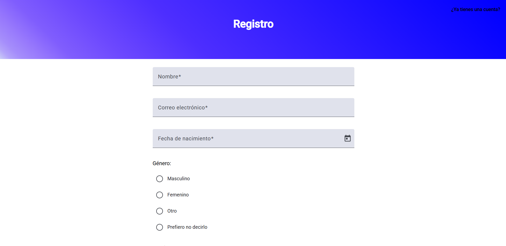
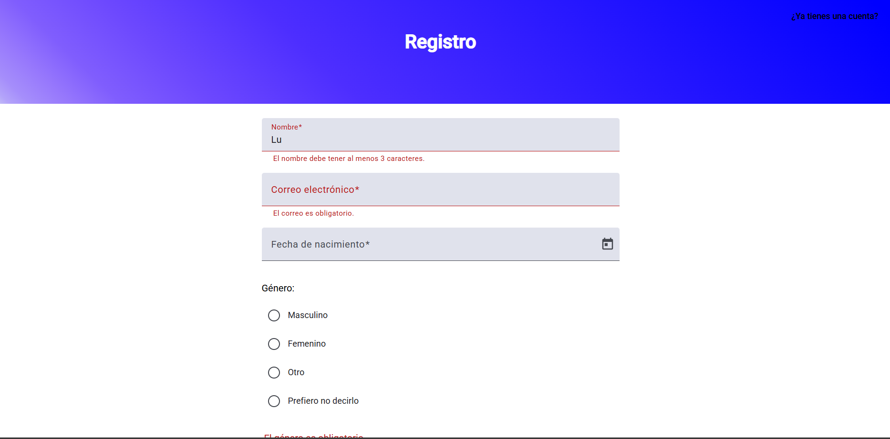
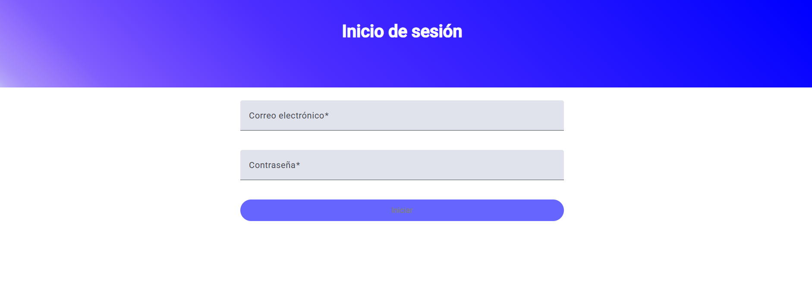
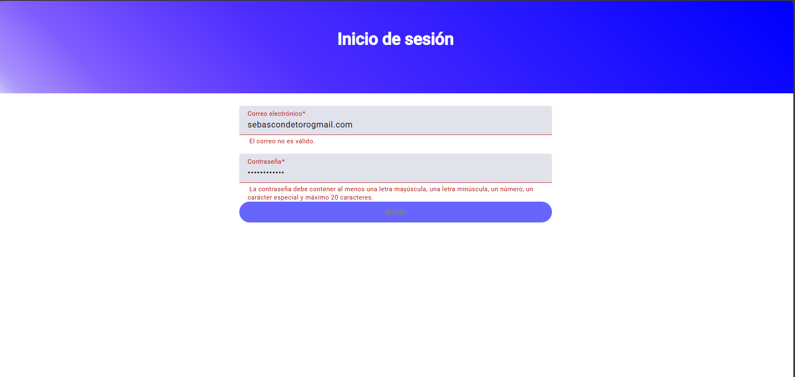

PruebaFrontend
Este proyecto fue generado usando Angular CLI versión 19.2.7.

🔗 Enlace de despliegue
Puedes ver el proyecto desplegado en:
https://prueba-angular-app-01.web.app

🚀 Instrucciones para ejecutar el proyecto en local
1. Clonar el repositorio
Clona el repositorio con el siguiente comando y entra a la carpeta del proyecto:
git clone https://github.com/SebastianConde/prueba-angular.git
cd prueba-angular

2. Instalar dependencias
Instala las dependencias necesarias ejecutando:
npm install

3. Ejecutar el servidor de desarrollo
Inicia el servidor local con:
ng serve

Luego abre tu navegador y ve a:
http://localhost:4200
La aplicación se recargará automáticamente al detectar cambios en el código.

🧪 Ejecutar pruebas unitarias
Para ejecutar las pruebas unitarias con Karma, usa:
ng test

🧩 Angular Material
Si necesitas agregar Angular Material al proyecto, puedes hacerlo con:
ng add @angular/material

🖥️ Uso de API en local (opcional)
Por defecto, el proyecto ya está configurado para usar la API desplegada en:
https://mockapi-iuyr.onrender.com
Esta funciona sin problemas tanto en producción como en desarrollo local, por lo que no es necesario cambiar nada para probar la app.

Si prefieres usar una API local:
Simula un backend local ejecutando:
json-server --watch src/assets/mock.json --port 3000

Esto iniciará una API falsa en:
http://localhost:3000

Cambia las URLs en los siguientes archivos para usar localhost:

src/app/services/pais.service.ts

src/app/services/productos.service.ts

src/app/services/register.service.ts

Dentro de cada uno, comenta la línea con la URL de despliegue y descomenta la que apunta a localhost. Por ejemplo:

// this.apiUrl = 'https://mockapi-iuyr.onrender.com';
this.apiUrl = 'http://localhost:3000';

---------------------------------------------------------------------------------------------------------------------------------------------------

En base al enunciado se cumplió con todos los requisitos:

Requerimientos técnicos:
● Framework: Angular
● Validación: Usar Reactive Forms
● Testing: Agregar al menos un test unitario por componente
● Mock API: Puedes usar herramientas como json-server, Mockoon o Mocki.io
● Uso de Angular Material, TailwindCSS o librerías UI similares

Estos requerimientos técnicos se cumplieron, reactive forms está presente en el login y en el registro.
Cada componente tiene su test unitario y se ejecuta de la forma que se dijo arriba.
Con json-server se creó la simulación de un backend que tuviera los endpoints, allí están los paises, las imagenes, y el guardado de los usuarios que se registran.
Se usó angular material para todas las vistas, principalmente en los formularios que tienen estos materiales y algunos modificados con scss.

1. Registro de Usuario
    Crea un formulario para registro con los siguientes campos:
        ● Nombre completo
        ● Correo electrónico (validación de formato)
        ● Contraseña (mínimo 8 caracteres)
        ● Confirmación de contraseña
        ● Fecha de nacimiento
        ● Género (radio)
        ● Intereses (checkbox)
        ● País de residencia (select dinámico desde mock API)
    Extras:
        ● Validación en tiempo real
        ● Visual feedback (input válido/inválido)
        ● Mensajes de error personalizados

El registro contiene los campos y validaciones mencionados usando reactive forms, hay comparación de que la contraseña y la confirmación de contraseña sean iguales y los paises salen de la mock API (json server) -> assets/mock.json.

Los errores se muestran en tiempo real mientras el usuario escribe, se valida que los campos sean obligatorios y que contengan las restricciones de validación, no permite registrar si hay campos con errores.

2. Autenticación de Usuario
    ● Crea una vista de login.
    ● Valida credenciales contra la mock API.
    ● Al autenticar, guarda la sesión (en localStorage o similar).
    ● Redirige al dashboard del usuario.
    Extras:
        ● Mostrar mensajes de éxito/error

Se puede acceder al login desde el registro en el caso de que el usuario ya este registrado todo para seguir el orden del enunciado, las credenciales se validan contra la mock API, y se muestran los errores de los campos, además del éxito o error del logueo.

3. Catálogo de Productos
    ● Crear una vista con listado de productos (imagen, nombre, precio, categoría).
    ● Implementar filtros:
    ● Búsqueda por nombre
    ● Ordenar por precio
    ● Mostrar detalles del producto en una vista independiente.
    ● Implementar paginación

Se redirige al catalogo luego del inicio de sesión, todo el catalogo es responsive y tiene la paginación, los filtros funcionan correctamente:

